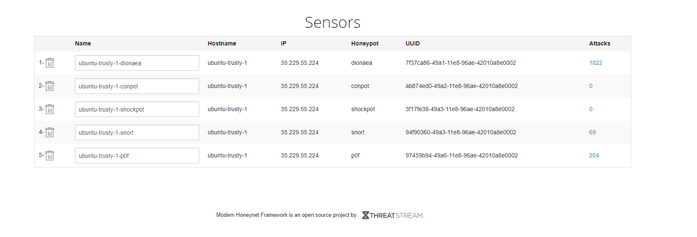
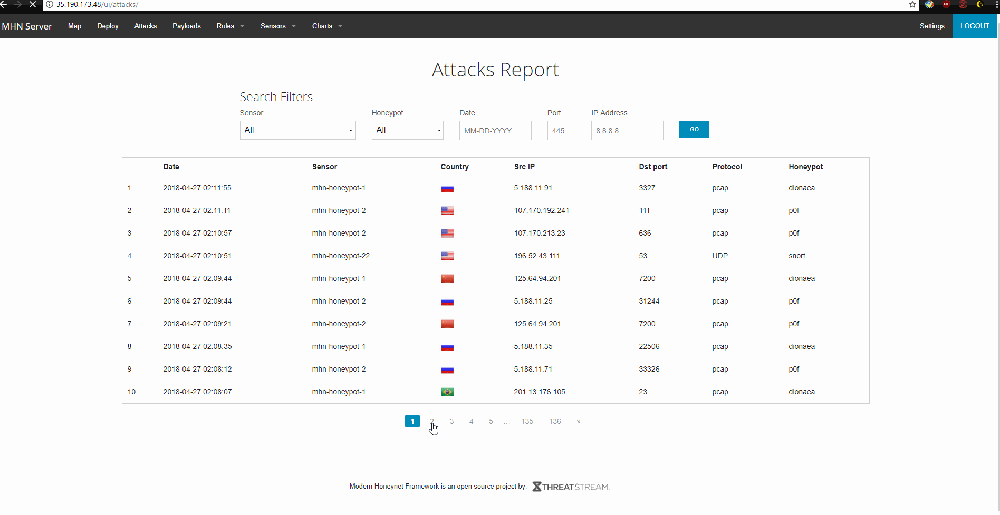

# week9

## Which Honeypot(s) you deployed

## Any issues you encountered
-No, I dont follow the instruction from the website. But the TA provides us with a different instruction which I followed and I dont encounter any issue.

## A summary of the data collected: number of attacks, number of malware samples, etc.

## Any unresolved questions raised by the data collected
 - No 
 
## Data
 - <a href=> LOGS </a>
  
